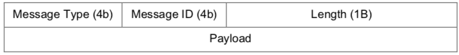
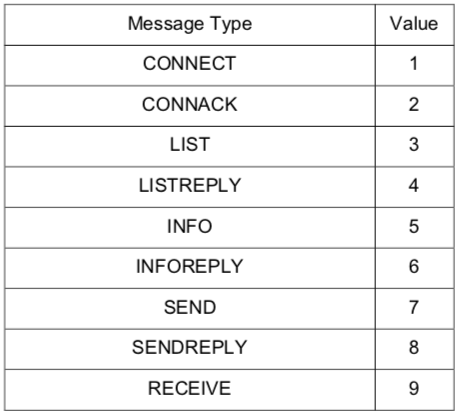
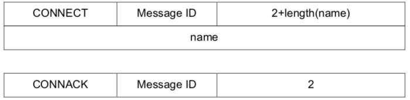
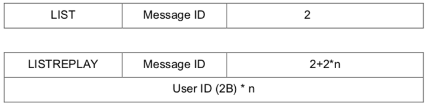
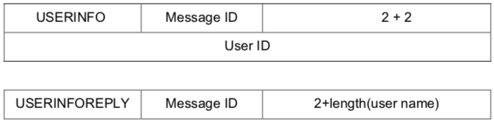
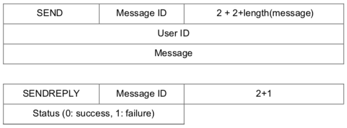
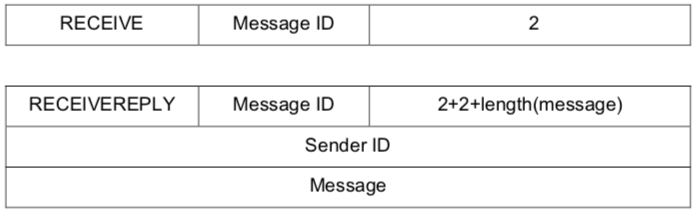

# Socket_Programming
Socket Programming on one **local host** and several **ports**. The clients connect with the server through **TCP connections**.

Each message is consisted of 4 parts: **message type, message ID, length,** and **payload**.



There are 9 different message types, each with a different **ID**, which enables TCP connections between different messages. 




**Length** section indicates the entire length of a message. 

After the client connects to the server, it will send its name through **CONNECT** to the server. The server will send **CONNACK** in respond to that message. 



Each client can ask for a complete list of its users through LIST. Server will send that list to the client through LISTREPLY. 



Each client can send the ID of a user through INFO, and ask for the user's name from the server. The server will answer through INFOREPLY, where the name of the user is stored in the payload section.




Client will use SEND to send a message, which contains the ID of the user that the message needs to be sent to, and the content of the message. The server will answer through SENDREPLY.



Client will use RECIEVE to recieve the messages that have been sent to it. Server will answer through RECIEVEREPLY. 



EXIT is used to terminate the program.

<h4>The Client:</h4>

The client program needs to provide 3 commands for the user: **List**, **Send**, and **Exit**.

**List:**

```
>>list
  -<User Name 1>
  -<User Name 2>
  ...
```

**Send:**

```
>>send <User Name> <Message>
```

**Exit**

```
<< <User Name> : <Message>
```

Below is an example of the executed program:

```
$ ./client localhost:9000 ali
>> list
  -sirous
>> send sirous Hello
<< sirous: Hi
>> exit
```

The server and the client are implemented in classes as follows:

<h4>Server:</h4>

```ruby
class Server {
public:
    Server(std::uint16_t port);
    void serve();
private:
    void client(int);

    int fd;
    ChatRoom room;
};
```

<h4>Client:</h4>

```ruby
class Client {
public:
    Client(int fd, ChatRoom& room);
    ~Client();

    void run();

private:
    void read(uint8_t* buffer, size_t len);
    void write(const uint8_t* buffer, size_t len);
    void connect(std::string name);
    std::vector<UserID> list();
    User info(UserID user_id);
    void send(UserID, std::string message);
    std::pair<UserID, std::string> receive();

    int fd;
    ChatRoom& room;
    bool connected = false;
    UserID user_id = 0;
};
```

Also, a class chatroom is implemented as below to manage the connections between server and client:

```ruby
class ChatRoom {
public:
    UserID connect(std::string name);
    void disconnect(UserID user_id);
    void send(UserID from_id, UserID to_id, std::string message);
    std::pair<UserID, std::string> receive(UserID id);
    std::vector<UserID> list();
    User info(UserID user_id);
private:
    std::map<UserID, User> users;
    std::mutex mutex;
    UserID next_user_id = 1;
};
```

Each of the commands mentioned above, are implemented in different functions in the code. 

Functions for the server are named as below, the implementation of each of these functions can be thoroughly seen in the code:

```ruby
vector<UserID> ChatRoom::list()
User ChatRoom::info(UserID user_id)
void ChatRoom::send(UserID from_id, UserID to_id, string message)
pair<UserID, string> ChatRoom::receive(UserID user_id)
Server::Server(std::uint16_t port)
void Server::serve() 
void Server::client(int client_fd) 
```

Functions for the client are named as below, the implementation of each of these functions can be thoroughly seen in the code:
```ruby
void Client::run() 
void Client::read(uint8_t* buffer, size_t len)
void Client::write(const uint8_t* buffer, size_t len) 
void Client::connect(string user_name)
User Client::info(UserID user_id_)
void Client::send(UserID id, string message) 
pair<UserID, string> Client::receive()
```

In the main function, the functions to  **recieve, seperate,** and send information is implemented.
